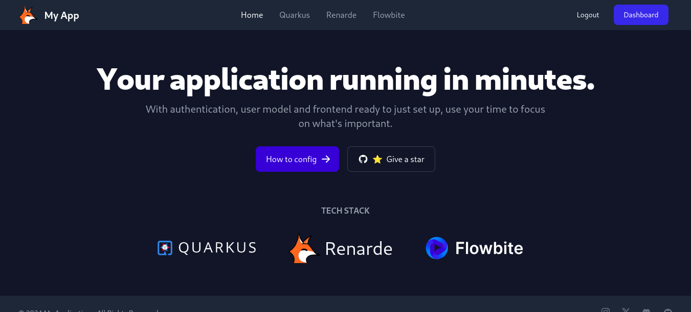
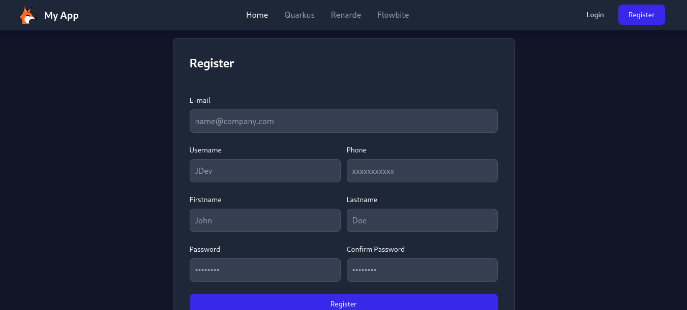
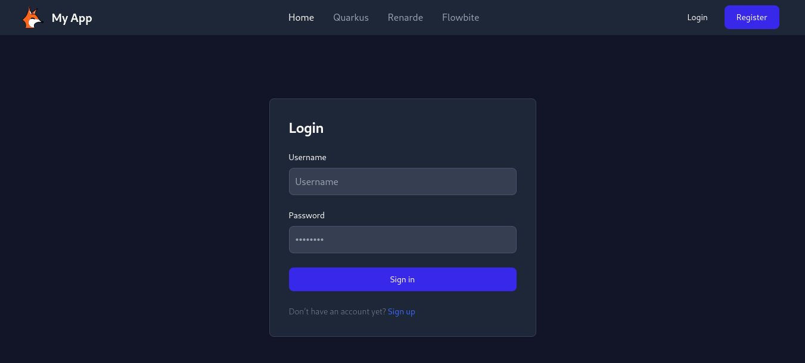
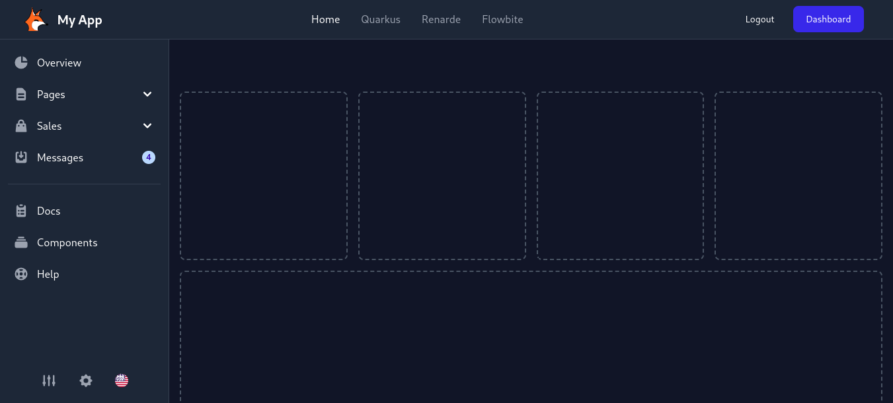

# 🦊 Renarde Tailwind Auth



Inspirado naqueles que priorizam *delivering over firula*, mas que não permitem
que suas entregas percam a qualidade por causa disso. O Renarde Tailwind Auth é
um scaffolding para agilizar projetos [**Quarkus MVC**](https://quarkus.io/guides/web).

A arquitetura clássica ainda é muito eficiente para resolver uma gama enorme de problemas
e vai nos acompanhar por muito tempo. A vida não é feita de microserviços e cloud não é mesmo meus jovens?!

💀💀😭😭

Nesse repositório, você encontra um scaffolding básico para autenticação em
uma aplicação Quarkus MVC. Com poucos comandos, você já estará com a implementação
básica da autenticação do Renarde.

## Uma visão geral do starter kit

### Flowbite e Tailwind *ready to use*

Uma biblioteca gratuita e com todos os componentes [**Tailwind**](https://tailwindcss.com/docs/installation)
que você vai precisar. Tudo ao alcance de um CTRL+C, CTRL+V.

> **_Componentes:_**  <https://flowbite.com/blocks/>

### Cadastro, Login e Dashboard 🤩🤩🤩

Utilizando a implementação básica do [**Renarde**](https://docs.quarkiverse.io/quarkus-renarde/dev/security.html),
o framework do [**Quarkus**](https://quarkus.io/guides) para projetos MVC,
você já começa com seus templates de cadastro, login e logout prontos! Como se não bastasse,
você também ganha um bom modelo de dashboard para o usuário logado, tendo um esqueleto perfeito
para começar a focar no que realmente importa.







## Instalando

Clone o repo:

```shell script
git clone https://github.com/lucaspicinini/renarde-tailwind-auth.git
```

Entre na pasta:

```shell script
cd renarde-tailwind-auth
```

Instale o Tailwind e o Flowbite:

```shell script
npm install
```

> Edite suas configurações de banco de dados no arquivo application.properties

Pronto! Agora você pode rodar o projeto com o comando `quarkus dev`.
Em seguida, abra outra aba do terminal, vá ao diretório do projeto novamente e execute
o comando `npm run tw-watch`. Dessa forma, seu projeto vai recompilar o
frontend automaticamente a cada alteração.
